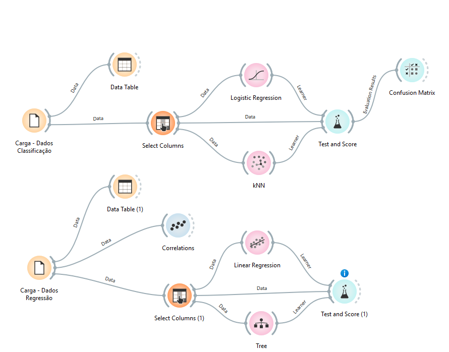
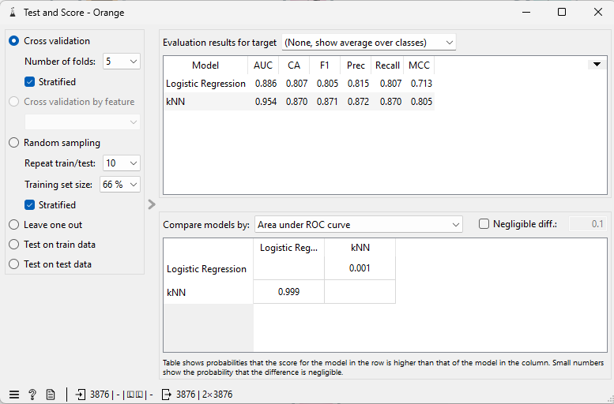
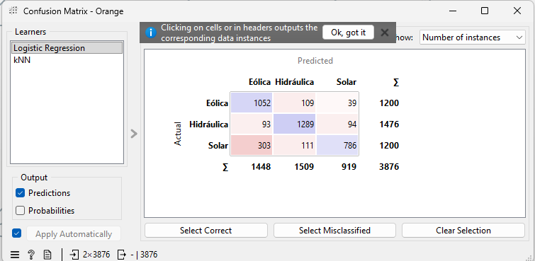
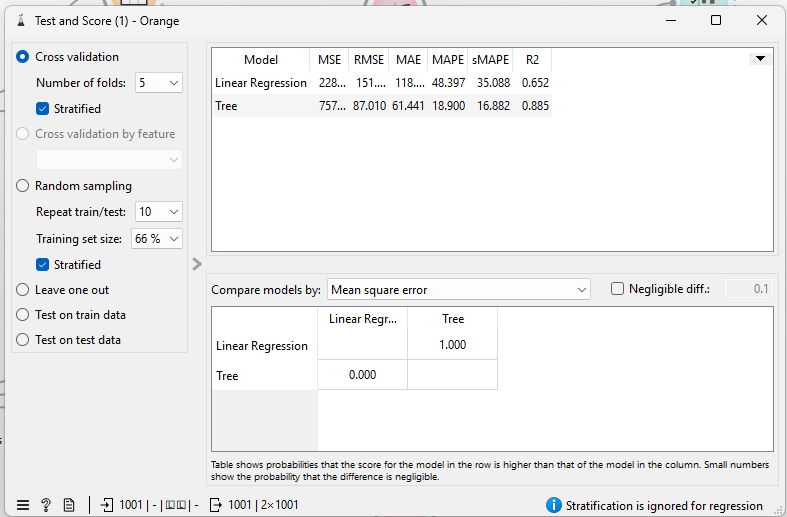

# Checkpoint 02 — APIs, energias renováveis e aprendizado de máquina

**Aluno:** Patrick Fernandes Martins Pais — RM572899 — Turma 1CCPW
**Disciplina:** Soluções em Energias Renováveis e Sustentáveis — Prof. André Tritiack

## Objetivo

Consultar duas APIs públicas de dados abertos e resolver duas tarefas de aprendizado de
máquina, comparando três algoritmos em cada uma:

1. **Classificação:** prever a fonte de um empreendimento de geração (Solar, Eólica ou
   Hidráulica) a partir de potência outorgada, latitude e longitude.
2. **Regressão:** estimar a radiação solar horária em Petrolina (PE) a partir de
   temperatura, umidade, cobertura de nuvens, vento e hora do dia.

## Dados

| Tarefa | Fonte | Período / recorte | Arquivo |
|---|---|---|---|
| Classificação | [SIGA — ANEEL](https://dadosabertos.aneel.gov.br/dataset/siga-sistema-de-informacoes-de-geracao-da-aneel) (API CKAN) | Até 1200 registros por sigla (UFV, EOL, UHE, PCH, CGH); 3876 empreendimentos válidos | `aneel_classificacao_orange.csv` |
| Regressão | [Open-Meteo — histórico](https://open-meteo.com/en/docs/historical-weather-api) | 01/04/2025 a 30/06/2025, horas de 7h a 17h, fuso America/Recife; 1001 horas | `meteo_regressao_orange.csv` |

Nenhuma das consultas exige token. Os CSVs estão no repositório e também são
regenerados pelo notebook a partir das APIs. Como a base da ANEEL é atualizada, uma
nova consulta pode retornar registros um pouco diferentes.

## Como executar

1. Abra `CP2_SERS_PRONTO.ipynb` no Google Colab ou em um Jupyter local
   (Python 3.10+).
2. A primeira célula instala as dependências: `pandas`, `matplotlib`, `seaborn`,
   `scikit-learn`.
3. Execute todas as células em ordem (*Reiniciar sessão e executar tudo*). O notebook
   consulta as APIs, gera os CSVs, treina os seis modelos e exibe tabelas, gráficos e
   conclusões.

## Resultados

### Tarefa 1 — Classificação (divisão estratificada 80/20, `random_state=42`, média macro)

| Modelo | Accuracy | Precision | Recall | F1 |
|---|---|---|---|---|
| Regressão Logística | 0,825 | 0,828 | 0,821 | 0,820 |
| KNN (k=5) | 0,965 | 0,966 | 0,964 | 0,965 |
| Random Forest | **0,976** | **0,977** | **0,974** | **0,975** |

Random Forest foi o melhor modelo. Solar é a classe mais confundida, sobretudo com
Eólica na Regressão Logística, porque as duas coexistem no interior do Nordeste.
Potência e localização não descrevem o recurso físico da usina, e unidades de um mesmo
complexo têm coordenadas quase idênticas, o que tende a inflar o desempenho medido.

### Tarefa 2 — Regressão (divisão temporal 80/20 sem embaralhar)

| Modelo | MAE (W/m²) | MSE ((W/m²)²) | R² |
|---|---|---|---|
| Regressão Linear | 145,2 | 30.034 | 0,360 |
| KNN (k=5) | 68,3 | 7.608 | 0,838 |
| Random Forest | **66,3** | **7.251** | **0,845** |

Random Forest foi o melhor modelo. A hora do dia é a variável mais importante (0,49),
porque define o teto físico de radiação; a Regressão Linear falha por tentar uma reta
numa relação em forma de sino. Estimar radiação não equivale a prever geração elétrica:
a energia produzida depende ainda de área, inclinação e eficiência dos painéis,
temperatura dos módulos, sombreamento e perdas do inversor.

## Atividade complementar — Orange Data Mining

Os dois CSVs gerados pelo notebook foram analisados no Orange usando o fluxo
`Fluxos_para_Classificacao_e_Regressao.ows` fornecido pelo professor (salvo aqui como
`fluxo_orange.ows`), conforme orientação em aula: dois algoritmos por tarefa, com a mesma
configuração de **Test and Score** dentro de cada tarefa.

### Classificação — ANEEL

Fluxo: File → Select Columns (features: `potencia_kw`, `latitude`, `longitude`; target: `fonte`)
→ Logistic Regression e kNN → Test and Score → Confusion Matrix.
Avaliação: **validação cruzada estratificada com 5 partes**, sobre os 3876 empreendimentos;
métricas com média sobre as classes.

| Modelo | CA (Accuracy) | Precision | Recall | F1 |
|---|---|---|---|---|
| Logistic Regression | 0,807 | 0,815 | 0,807 | 0,805 |
| kNN | **0,870** | **0,872** | **0,870** | **0,871** |

O kNN foi o melhor dos dois. A matriz de confusão da Regressão Logística mostra o mesmo
padrão do notebook: **Solar é a classe mais confundida**, com 303 usinas solares previstas
como Eólica e 111 como Hidráulica (de 1200), enquanto 109 eólicas foram previstas como
Hidráulica. Solar e eólica coexistem no interior do Nordeste, e uma fronteira linear não
separa esses agrupamentos geográficos.

Comparação com o notebook: a Regressão Logística ficou próxima (0,805 vs 0,820 de F1), mas
o kNN caiu de 0,965 para 0,871. A diferença provável é a **padronização**: no notebook o
kNN roda dentro de um `Pipeline` com `StandardScaler`; no Orange, sem esse passo, a
`potencia_kw` (em milhares de kW) domina o cálculo de distância e a localização quase não
pesa. Isso confirma na prática a importância de escalar os dados para algoritmos baseados
em distância. A limitação de fundo é a mesma: potência e localização não descrevem o
recurso físico (sol, vento, água) que define a fonte.

### Regressão — Open-Meteo

Fluxo: File → Select Columns (features: `temperatura_c`, `umidade_pct`, `nuvens_pct`,
`vento_kmh`, `hora`; target: `radiacao_w_m2`; meta: `data_hora`) → Linear Regression e
Tree → Test and Score.
Avaliação: **validação cruzada com 5 partes**, sobre as 1001 horas. Essa divisão é
aleatória e não respeita a ordem temporal, o que tende a superestimar o desempenho; por
isso as métricas não são diretamente comparáveis às do notebook, que usou divisão temporal
80/20.

| Modelo | RMSE (W/m²) | MSE ((W/m²)²) | MAE (W/m²) | R² |
|---|---|---|---|---|
| Linear Regression | 151,4 | ≈ 22.900 | ≈ 118 | 0,652 |
| Tree | **87,0** | **7.571** | **61,4** | **0,885** |

O Orange exibe RMSE; o MSE foi obtido por **MSE = RMSE²**.

A Tree foi muito superior à Regressão Linear, pelo mesmo motivo observado no notebook: a
radiação sobe e desce ao longo do dia (formato de sino em função da `hora`), e uma reta não
representa essa curva, enquanto a árvore separa o dia em faixas de hora. A Regressão Linear
obteve R² 0,652 no Orange contra 0,360 no notebook: como a validação cruzada mistura horas
de abril e junho no treino e no teste, o modelo é avaliado em condições que já viu, o que
ilustra a superestimação prevista acima.

Estimar radiação não equivale a prever geração elétrica: W/m² é a energia solar que chega
ao plano horizontal, e a energia produzida depende ainda da área, inclinação e eficiência
dos painéis, da temperatura dos módulos, de sombreamento e sujeira, das perdas do inversor
e do tempo de exposição (energia em kWh exige integrar a potência ao longo das horas).

## Estrutura do repositório

- `CP2_SERS_PRONTO.ipynb` — notebook completo (APIs, análise, seis modelos e conclusões)
- `aneel_classificacao_orange.csv` — dados da Tarefa 1
- `meteo_regressao_orange.csv` — dados da Tarefa 2
- `README.md` — este arquivo
- `aneel_treino.csv`, `aneel_teste.csv`, `meteo_treino.csv`, `meteo_teste.csv` — divisões de treino/teste exportadas pelo notebook
- `fluxo_orange.ows` — fluxo do Orange
- `orange_*.png` — capturas dos fluxos, tabelas do Test and Score e matriz de confusão
